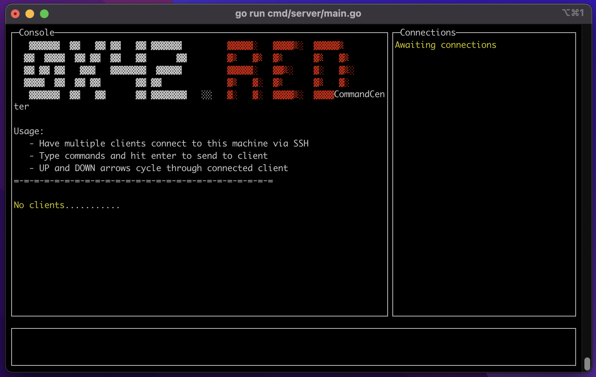
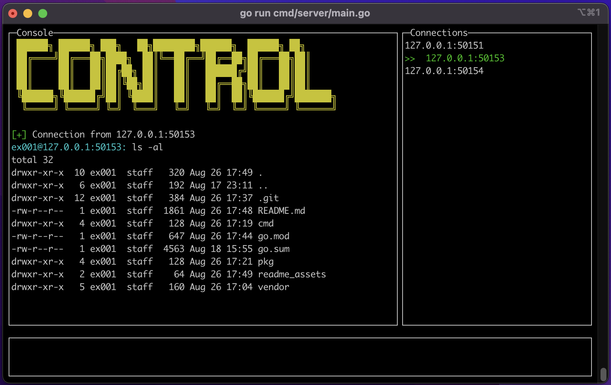

```diff
-   ▓▓▓▓▓▓  ▓▓   ▓▓ ▓▓   ▓▓ ▓▓▓▓▓▓         ▓▓▓▓▓░   ▓▓▓▓▒░  ▓▓▓▓▓▒
-  ▓▓  ▓▓▓▓  ▓▓ ▓▓  ▓▓   ▓▓      ▓▓        ▓▒   ▓▒  ▓▒      ▓▒   ▓▒
-  ▓▓ ▓▓ ▓▓   ▓▓▓   ▓▓▓▓▓▓▓  ▓▓▓▓▓         ▓▓▓▓▓░   ▓▓▒░    ▓░   ▓▒░
-  ▓▓▓▓  ▓▓  ▓▓ ▓▓       ▓▓ ▓▓             ▓▒   ▓░  ▓▒      ▓▒   ▓░
-   ▓▓▓▓▓▓  ▓▓   ▓▓      ▓▓ ▓▓▓▓▓▓▓   ░░   ▓░   ▓░  ▓▓▓▓▒░  ▓▓▓▓▓░

                            /
 ꓷ
 ꓠ ██████╗ ██████╗ ███╗   ██╗████████╗██████╗  ██████╗ ██╗      
 ꓯ ██╔════╝██╔═══██╗████╗  ██║╚══██╔══╝██╔══██╗██╔═══██╗██║     
 ɯ ██║     ██║   ██║██╔██╗ ██║   ██║   ██████╔╝██║   ██║██║      
 ɯ ██║     ██║   ██║██║╚██╗██║   ██║   ██╔══██╗██║   ██║██║     
 O ╚██████╗╚██████╔╝██║ ╚████║   ██║   ██║  ██║╚██████╔╝███████╗
 Ɔ  ╚═════╝ ╚═════╝ ╚═╝  ╚═══╝   ╚═╝   ╚═╝  ╚═╝ ╚═════╝ ╚══════╝
```
---

## Disclaimer
Command/Control is software meant to only be used on systems you have permission for.  You are responsible for your own local laws and ethics.  Don't be a jerk, keep it legal.


## About
Command/Control is a client and server used for reverse ssh shells.  I wanted to create something that was easy to deploy, easy to use, secure, and had no dependancies.  Bonus points if it has ANSI art.

So here we are.


## How-To / Docs
TL;DR
```bash
git clone git@github.com:0x42red/command_control.git
cd command_control
cp pkg/embeddata/config/config.yaml.example pkg/embeddata/config/config.yaml
# Edit the config.yaml to update the host and port
go generate ./...
go build cmd/command/command_server.go
go build cmd/control/control_client.go
# Have fun, stay legal, dont be a jerk
```

This gives you two binaries.  The `command_server` acts as your ssh server that clients will connect to.  The `control_client` acts as your clients to connect to the `command_server`.


## Screenshots
Here we can see what the command server looks like when it is first booted up.


In this screenshot we have three connected clients, and have sent a command to client #2.



## TODO
- Rewrite client to not use third party library
- Make client fault resilient 